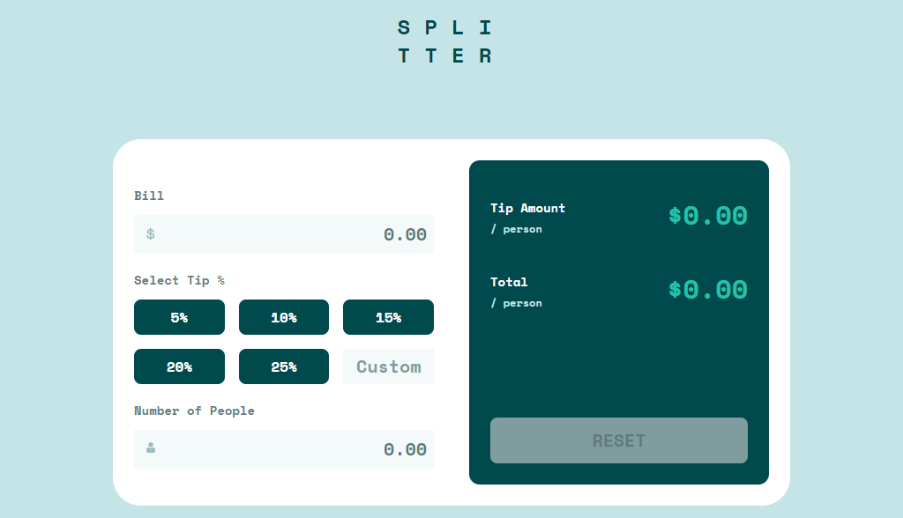

## Overview

This is a solution to the [Tip calculator app challenge on Frontend Mentor](https://www.frontendmentor.io/challenges/tip-calculator-app-ugJNGbJUX). Frontend Mentor challenges help you improve your coding skills by building realistic projects.

### The challenge

Users should be able to:

- View the optimal layout for the app depending on their device's screen size
- See hover states for all interactive elements on the page
- Calculate the correct tip and total cost of the bill per person

### Screenshot

### Links

- Solution URL: [Solution](https://www.frontendmentor.io/solutions/tailwind-vanilla-js-mobile-first-approach-vneXA26PSm)
- Live Site URL: [Live-site](https://iridescent-duckanoo-cf31d7.netlify.app/)

## My process

- Observe the lay out
- Mobile first approach
- Coding the HTML skeliton first
- Use Tailwind for layout and design
- Finally build JS logic for calculator

### Built with

- Semantic HTML5 markup
- Tailwind CSS
- vanilla JS
- Grid
- Mobile-first workflow

### What I learned

I have learned to use semantic HTML tags ,use Tailwing grid and JS logic building.

### Useful resources

- [Dev Ed](https://www.youtube.com/results?search_query=+dev+ed) - This helped me for understanding JS calculator logic.

## Author

- Website - [Ahanaf](https://github.com/AhanafVai)
- Frontend Mentor - [@AhanafVai](https://www.frontendmentor.io/profile/AhanafVai)
- Twitter - [@Ahanafabdullah1](https://twitter.com/Ahanafabdullah1)

## Acknowledgments

- [Dev Ed](https://www.youtube.com/results?search_query=+dev+ed)
